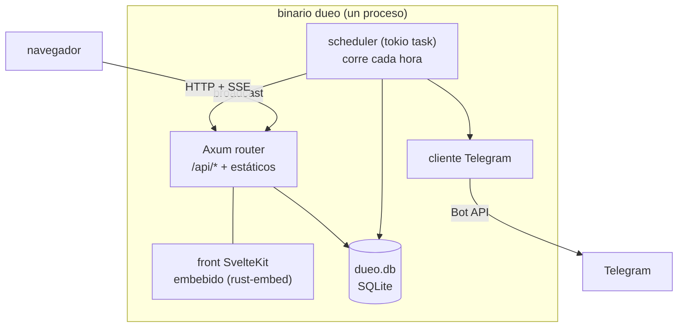

# Arquitectura de Dueo

> Documento de diseño: qué decisiones se tomaron, por qué, y qué se descartó.
> Pensado para quien quiera entender el proyecto a fondo (o evaluar el criterio
> de ingeniería detrás). El "cómo usarlo" está en el [README](../README.md).

## TL;DR

Dueo es un panel selfhosted de suscripciones construido como **un solo binario**:
un servidor **Rust + Axum** que sirve la API y, embebido en el propio ejecutable, el
front **SvelteKit**. Persistencia en **SQLite** (un archivo). Sin Redis, sin cola de
mensajes, sin proceso aparte para el front. Toda la complejidad —scheduler de
recordatorios, notificaciones en tiempo real, multi-usuario— vive dentro de ese
único proceso, a propósito: **la simplicidad de operación es una feature** para
selfhosting.



## Por qué este stack

Cada elección responde a una meta: **selfhosting de operación simple**. Un panel que
alguien monta en su servidor o NAS no debería exigir una pila de servicios para
arrancar. De ahí el binario único y SQLite, y de ahí el resto:

| Capa | Elección | Razón |
| --- | --- | --- |
| API | Rust + Axum | binario único, sin runtime ni dependencias del sistema |
| DB | SQLite vía `sqlx` | un archivo, cero setup; backup = copiar el archivo |
| Front | SvelteKit (Svelte 5, runes) | UI animada con bundle mínimo, exportable a estático |
| Tiempo real | SSE | unidireccional server→cliente: más simple que WebSocket |
| Scheduler | tarea `tokio` en proceso | sin Redis/colas externas |
| Auth | sesión + Argon2, cookie httpOnly | multi-usuario real, sin JWT ni dependencias |
| Distribución | `adapter-static` + `rust-embed` | front dentro del binario |

Trade-off asumido: Rust hace el MVP algo más lento de escribir que Go/TS, pero paga
en el objetivo de binario único, arranque instantáneo y huella mínima.

## Mapa del código

```
dueo-server/                 # Rust + Axum
  src/
    main.rs                  # router, estado compartido, arranque, estáticos embebidos
    auth.rs                  # registro/login/sesión, extractor AuthUser, seguridad
    subscriptions.rs         # CRUD del dominio principal
    categories.rs            # CRUD de categorías
    reminders.rs             # reglas de anticipación (globales / por servicio)
    scheduler.rs             # motor de recordatorios (corre cada hora)
    notifications.rs         # panel in-app + stream SSE
    channels.rs              # abstracción de canales (config/destinos/deliver idempotente)
    telegram.rs              # canal Telegram (cliente Bot API)
    email.rs                 # canal email (SMTP vía lettre)
    data.rs                  # export / import
    users.rs                 # gestión de usuarios (admin)
    update.rs                # aviso de versión nueva (consulta releases de GitHub)
    validate.rs              # validación de entrada del dominio
  migrations/                # 0001..0008, versionadas y embebidas (sqlx::migrate!)
dueo-web/                    # SvelteKit (SPA, ssr=off)
docs/ARCHITECTURE.md         # este documento
.github/workflows/          # CI (check/lint/build) + release (release-please + imagen GHCR)
Dockerfile · docker-compose.yml
```

## Aislamiento multi-usuario (la invariante central)

Dueo es multi-usuario en una instalación personal/hogar (no SaaS multi-tenant). La
regla de oro: **un usuario nunca puede ver ni tocar datos de otro**. Cómo se
garantiza, en vez de confiar en recordar el filtro en cada query:

- Un **extractor de Axum** (`AuthUser`, vía `FromRequestParts`) resuelve el `user_id`
  desde el token de sesión en cada petición protegida. Un handler que necesita
  identidad simplemente lo pide como argumento: si no hay sesión válida, ni siquiera
  se ejecuta (responde 401).
- **Toda** query del dominio lleva `WHERE ... AND user_id = ?`. No hay acceso "global".
- Acceder a un recurso ajeno devuelve **404, no 403**: no revelamos que existe.

```rust
// El handler declara su dependencia; el extractor hace cumplir la invariante.
pub async fn get_one(State(state): State<AppState>, user: AuthUser, Path(id): Path<i64>)
    -> Result<Json<Subscription>, ApiError>
{
    // "AND user_id = ?" → lo de otro usuario simplemente "no existe".
    sqlx::query_as("SELECT ... FROM subscriptions WHERE id = ? AND user_id = ?")
        .bind(id).bind(user.user_id) // <- inyectado, no parámetro del cliente
        ...
}
```

Roles: `admin` (gestiona cuentas) y `member`. El primer usuario registrado en una
instancia vacía se vuelve admin automáticamente. Las operaciones de admin pasan por
un guard `require_admin` y tienen salvaguardas (no puedes borrarte a ti mismo ni
dejar la instancia sin ningún administrador).

## Modelo de datos

Decisiones que reflejan criterio más que andamiaje:

- **El dinero siempre en centavos** (`amount_cents INTEGER`). Nunca floats para
  importes: se evita el redondeo binario de raíz.
- **Multi-moneda sin conversión en el MVP.** Sumar centavos de monedas distintas es
  un bug; el dashboard **agrupa el total por divisa** y avisa cuando hay varias. La
  conversión normalizada queda fuera del MVP, explícitamente diferida.
- **Integridad por foreign keys con borrado en cascada.** SQLite **no** aplica FKs
  por defecto, así que se activa `PRAGMA foreign_keys = ON` por conexión en las
  opciones del pool. Con eso, borrar un usuario arrastra en cascada sus sesiones,
  categorías, suscripciones, reglas y log de notificaciones; borrar una categoría
  deja sus suscripciones en `NULL` (`ON DELETE SET NULL`), no las borra.
- **Migraciones versionadas y embebidas** (`sqlx::migrate!`): el binario aplica el
  esquema al arrancar; no hay paso de migración manual en el deploy.

## El motor de recordatorios

El diferencial operativo ("que me avise") es un scheduler **dentro del binario**, sin
cron del sistema ni colas. Decisiones clave:

- **Corre cada hora**, no cada 24h. En cada tick, para **cada usuario** calcula su
  hora local (`chrono` + `chrono-tz`) y solo si coincide con su `send_hour`
  configurada evalúa su "hoy" en su zona. Así cada usuario recibe el aviso a su hora
  local sin un scheduler por-usuario.
- **Idempotencia por diseño.** Cada disparo se registra en `notification_log` con un
  `UNIQUE(subscription_id, channel, target_due_date, days_before)` e `INSERT OR
  IGNORE`. Aunque el proceso rearranque o el tick se repita, **cada recordatorio se
  emite una sola vez**. (El `INSERT ... RETURNING` distingue "insertó de verdad" de
  "ya existía", y solo en el primer caso se empuja la notificación.)
- **Reglas efectivas.** Las anticipaciones pueden ser globales del usuario
  (`subscription_id NULL`) o propias de un servicio; las propias **sustituyen** a las
  globales para ese servicio.
- **Tono según el modo de pago.** El mensaje cambia si es domiciliado (informativo)
  o manual (empujón a pagar), con versión *plain* para in-app/log y *HTML* para
  Telegram/email.
- **Canales desacoplados.** `channels.rs` abstrae los destinos: el in-app siempre se
  registra; Telegram y email se entregan a través de un `deliver()` con su propia
  idempotencia (una `LogKey` por canal en `notification_log`), así un fallo de envío
  reintenta en el siguiente tick sin duplicar lo ya entregado. Los destinos por usuario
  (`chat_id`, correo) se cargan **una vez por corrida** (sin N+1) y el cliente/SMTP se
  construyen una sola vez y se reutilizan.

> **Robustez del disparo** (correcciones de timing): el gate de envío dispara una vez
> por día local **a partir** de la `send_hour` (no solo en el tick exacto), con un mapa
> en memoria de "última fecha corrida" por usuario; así un tick saltado (suspensión,
> throttling, reloj sesgado) no pierde el aviso del día. Y los recordatorios se evalúan
> **antes** del mantenimiento de ciclo, para que un aviso del mismo día no se pierda
> ante un roll/expire de esa fecha.

## Recurrencia al vencer

Cuando una suscripción recurrente vence, el mantenimiento horario decide según el
modo de pago:

- **Domiciliada** (`payment_mode = auto`): **auto-renueva** —rueda al siguiente ciclo
  (`chrono::Months` para meses/años, o `cycle_days` para personalizado) y sigue
  activa.
- **Manual:** pasa a `expired`, para que el usuario confirme el pago y la renueve.

Sin re-registrar nada ni tareas extra: el mismo bucle que evalúa recordatorios hace
el mantenimiento.

## Notificaciones en tiempo real (SSE)

In-app sin recargar, con la pieza más simple que funciona:

- Un canal `tokio::sync::broadcast` en el estado compartido (`AppState`).
- Cuando el scheduler **inserta** una notificación nueva, la publica en el canal.
- El endpoint `GET /api/notifications/stream` es un SSE de Axum que **filtra por
  `user_id`** (otra vez la invariante de aislamiento) y reenvía solo lo del usuario
  conectado. La campanita del front abre un `EventSource` y antepone en vivo.

SSE en vez de WebSocket porque el flujo es unidireccional (servidor → cliente); si
algún día hace falta bidireccional, se reevalúa.

## Frontend: decisiones de UI

El front es SvelteKit (Svelte 5, runes) como SPA con `ssr=off`. Las piezas con más
criterio:

- **i18n reactivo hecho a mano** (~30 líneas de runes, sin librería). Un diccionario
  `clave → { es, en }`; `t()` **lee `lang` (un `$state`) dentro de la función**, así
  cambiar idioma re-renderiza todo lo que llama a `t()` sin recargar. Fallback en
  cadena (idioma actual → idioma por defecto → la propia clave, para que un idioma
  incompleto no rompa nada) y auto-detección (storage → `navigator.language` → default).
  El **idioma es independiente de la moneda**: traducir la UI no cambia importes.
- **Catálogo de marcas perezoso.** Los iconos de marca (Simple Icons, 3000+) no se
  empaquetan: se hace *code-split* y se traen **bajo demanda** al elegir/mostrar una.
  Un flag `ready` (`$state`) dispara la re-resolución cuando el catálogo carga, de modo
  que el icono aparece solo cuando está, sin bloquear el render.
- **HorizonTimeline a medida.** La línea de tiempo de vencimientos hace un layout
  **anti-solape por carriles** (estilo ramas de git), conectores Bézier, *zoom anclado
  al cursor* (se mantiene fija la fecha bajo el puntero al hacer zoom) y un gradiente de
  urgencia con opacidad según proximidad. Es un componente propio, no una librería de
  charting, porque el comportamiento es específico del dominio.
- **Helpers SVG sin dependencias.** `ring.ts` dibuja anillos de progreso con arcos
  redondeados y rampa de color HSL (un `polar()` con 0° arriba), y el `DonutChart` usa
  el truco de `pathLength=100` para componer arcos en **porcentaje** sin calcular
  circunferencias. Cero dependencias de gráficos.
- **Tema sin parpadeo + disciplina de skeletons.** Un script inline en `app.html` fija
  el tema **antes de la hidratación** (no hay *flash* de tema claro). Y en vez de
  spinners de "Cargando…", los estados de carga usan **skeletons** que clonan la grilla
  real (cero *layout shift*), con transiciones en toda aparición/desaparición.

- **Cliente API tipado.** Todas las llamadas pasan por un `req<T>() → Res<T>{ ok, status,
  data, error }`: nunca lanza ante un no-2xx, centraliza el 401 (redirige a login una
  sola vez) y declara `Content-Type` solo cuando hay cuerpo. Cada endpoint expone su
  tipo de retorno.

## Detalles de API que reflejan criterio

- **PATCH parcial real.** Las actualizaciones usan `COALESCE(?, columna)`: solo cambia
  lo que viene en el cuerpo, el resto se queda.
- **El truco del doble `Option` (serde).** Para campos *nullables* hay que distinguir
  tres intenciones en un PATCH: "no toques", "ponlo a X" y "ponlo a NULL". Un
  `Option<T>` no alcanza. Se usa `Option<Option<T>>` con `deserialize_with`: clave
  ausente → `None` (no tocar); clave presente con valor → `Some(Some(x))`; clave
  presente `null` → `Some(None)` (poner NULL). En SQL se traduce a
  `CASE WHEN ? THEN ? ELSE columna END`. Así "renovar" (que omite la categoría) no la
  borra, pero el usuario sí puede quitarla mandando `null`.
- **Login que no filtra información.** Usuario inexistente y contraseña incorrecta
  devuelven el **mismo** error genérico; no se revela si un usuario existe.
- **Import transaccional con remapeo de ids.** `POST /api/import` recrea categorías y
  suscripciones en **una transacción** (todo o nada) remapeando los ids viejos a los
  nuevos (la `category_id` de cada sub, la `subscription_id` de cada regla). Como las
  reglas globales tienen `subscription_id NULL` y en SQLite los `NULL` no colisionan
  en un `UNIQUE`, la deduplicación se hace explícita con `WHERE NOT EXISTS (... IS ?)`.

## Distribución: un solo binario

El objetivo selfhosted es "móntalo con un comando". Cómo se logra:

- El front se exporta **estático** (`@sveltejs/adapter-static`, SPA con fallback a
  `index.html`; el SSR ya está desactivado).
- `rust-embed` mete `dueo-web/build/` dentro del binario. Un *fallback handler* de
  Axum sirve el archivo embebido que corresponda y, para rutas de cliente que no son
  un archivo (p. ej. `/ajustes`), devuelve `index.html` para que el router del front
  resuelva.
- **Ergonomía de desarrollo:** en *debug*, `rust-embed` lee de disco (tocas el front
  sin recompilar Rust); en *release*, lo embebe → un ejecutable autónomo.
- La dirección de escucha es configurable (`DUEO_BIND`): `127.0.0.1` en local,
  `0.0.0.0` en contenedor.

El `Dockerfile` es multi-stage: build del front (Node) → build del server embebiéndolo
(Rust) → imagen runtime mínima (`debian-slim`) con solo el binario y un volumen para
`dueo.db`.

**CI/CD.** GitHub Actions valida cada push/PR (front: `check`/`lint`/`build`; server:
`fmt`/`clippy -D warnings`/`build`, construyendo el front antes porque `rust-embed`
apunta a `dueo-web/build/`). Las **releases** se automatizan con *release-please*
(Conventional Commits → PR de release que bumpea versión + CHANGELOG; al mergearlo se
crea el tag/Release y, en el mismo run, se construye y publica la **imagen multi-arch
en GHCR**, amd64+arm64 en runners nativos). Con la imagen publicada, actualizar es
`docker compose pull && docker compose up -d` (los datos persisten en el volumen).

**Aviso de versión nueva** (`update.rs`): `GET /api/update` compara la versión en
ejecución con la última release de GitHub y la UI avisa en *Ajustes → Acerca de*. Solo
**notifica** (un contenedor no se reemplaza a sí mismo); cachea ~24h y es desactivable
(`DUEO_UPDATE_CHECK=0`). Es un GET a una API pública, sin telemetría.

## Seguridad

- Contraseñas con **Argon2** + salt por usuario; nunca en claro.
- Sesión por **token opaco** en cookie **httpOnly**, `SameSite=Lax`; el servidor
  resuelve el `user_id` en cada request. Sin tokens en `localStorage`.
- "Cerrar todas las sesiones" borra las filas de sesión del usuario (revocación real,
  no esperar a que expire un JWT).
- Aislamiento por `user_id` en cada query (ver arriba) como defensa principal de
  datos. Los **secretos de canal** (token del bot de Telegram, credenciales SMTP) viven
  en variables de entorno, nunca en la BD ni en el código; solo el **destino por usuario**
  (`chat_id`, correo) se guarda en BD porque es configuración de cada cuenta.
- **Endurecimiento adicional:** registro cerrado por defecto (`DUEO_OPEN_REGISTRATION`),
  *rate-limit* de login (5 intentos / 15 min → 429), cookie `Secure` opcional tras TLS
  (`DUEO_SECURE_COOKIE`), política de contraseña (mínimo y variedad), expiración de
  sesiones (30 días) con limpieza periódica, y cabeceras de seguridad en cada respuesta
  (`X-Content-Type-Options`, `X-Frame-Options: DENY`, `Referrer-Policy`).

## Decisiones diferidas (a propósito)

- **Multi-moneda con conversión** y total normalizado.
- **i18n de extremo a extremo:** la UI ya es ES/EN reactiva, pero los **mensajes que
  genera el backend** (recordatorios, errores de validación) aún se emiten en español;
  falta exponerlos traducibles según el idioma del usuario.
- **Contratos tipados** front↔back generados desde Rust (`ts-rs`) como única fuente
  de verdad (hoy el cliente está tipado a mano).
- Emparejamiento de Telegram por código `/start` para chats privados (hoy el destino
  se configura directo, ideal para grupos selfhosted).

Cada una está escrita para no fingir que el MVP es más de lo que es, y para que el
siguiente que toque el código sepa qué quedó fuera y por qué.
